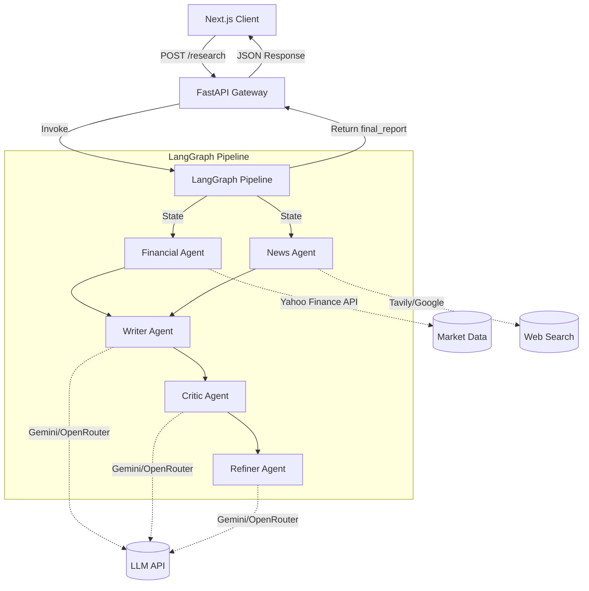

# Verdict System Architecture

Verdict is built on a decoupled, state-managed architecture designed for modularity, safety, and strict schema validation. This document outlines the application layers and pipeline data flows.

## 1. System Topology Overview

---

## 2. Frontend Architecture (Next.js)

The client is a React application built using the Next.js App Router:
- **Presentation Adapter Layer**: Implemented inside `frontend/src/lib/reportAdapter.ts` to convert snake_case backend database fields into clean presentation interfaces (`executiveSummary`, `financialAnalysis`, etc.). This shields components from backend schema revisions.
- **State Management**: Managed using **Zustand** for lightweight global UI states (Focus Mode, Watchlist, history toggling).
- **Responsive Layout**: Adjusts visual priority. On successful report compilation, the left agent execution timeline collapses to allow the report panel to expand to full-width (`col-span-12`), maximizing focus on the generated report.

---

## 3. Backend Architecture (FastAPI & LangGraph)

The server exposes async endpoints and coordinates specialized neural agent subroutines:
- **API Gateway**: Handled by FastAPI to orchestrate incoming queries. Requests are validated via Pydantic (`ResearchRequest`).
- **LangGraph State Machine**: Manages state transitions using `TypedDict` variables. The nodes execute sequentially:
  1. **Financial Agent**: Interacts with yfinance to scrape valuation metrics, dividend yields, and institutional consensus ratings.
  2. **News Agent**: Fetches web search news articles and sentiment-scores titles into classification tags ("Bullish", "Bearish", "Neutral").
  3. **Writer Agent**: Produces the initial draft segments.
  4. **Critic Agent**: Reviews findings against scraped metrics to catch hallucinations or factual bugs.
  5. **Refiner Agent**: Packages critical feedback into a strictly schema-validated JSON payload using Langchain's structured output bindings.
