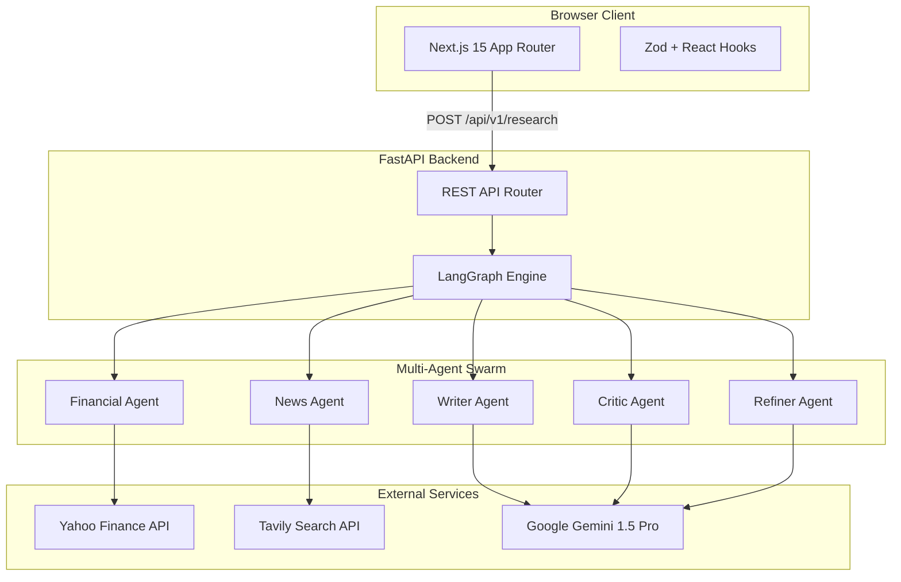
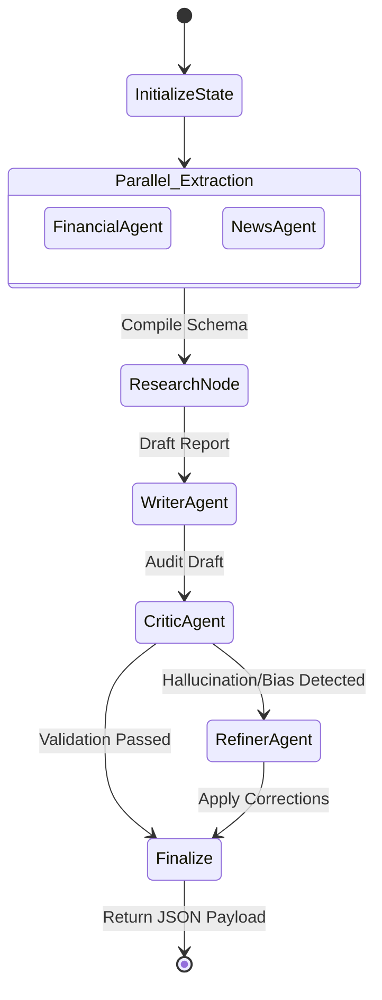

<div align="center">

# Verdict

**The Open-Source Agentic Financial Intelligence Platform**

[](https://github.com/saiiexd/Verdict-Agentic-Research-Analyst)
[](LICENSE)
[](https://www.python.org/)
[](https://fastapi.tiangolo.com/)
[](https://nextjs.org/)
[](https://react.dev/)
[](https://www.typescriptlang.org/)
[](https://langchain-ai.github.io/langgraph/)
[](https://ai.google.dev/)
[](https://www.docker.com/)

Verdict is an autonomous, multi-agent financial research workspace that synthesizes real-time market data, global news sentiment, and algorithmic validation into institution-grade equity analysis reports. 

[Live Demo](https://verdict-demo.vercel.app) • [API Documentation](#rest-api-documentation) • [Installation](#installation--local-development) • [Contributing](#contributing)

</div>

---

## Why Verdict Exists

In the modern financial landscape, retail investors and independent analysts are heavily disadvantaged by information fragmentation. Conducting diligent equity research requires constantly context-switching between quantitative data terminals (like Bloomberg or Yahoo Finance), real-time news aggregators, SEC filing databases, and macro-economic trackers.

While Large Language Models (LLMs) promised to solve this, a single zero-shot prompt to an LLM inevitably results in outdated data, severe factual hallucinations, and catastrophic mathematical errors.

**Verdict solves this through Agentic Orchestration.**
Rather than relying on a single prompt, Verdict deploys a coordinated swarm of specialized AI Agents. We treat the LLM not as a knowledge base, but as a reasoning engine. Dedicated nodes fetch live data, draft analysis, relentlessly critique the findings for bias or hallucination, and iteratively refine the final report before it ever reaches the user interface.

## Product Overview

Verdict serves as a unified workspace for financial intelligence. Upon entering a global equity ticker (e.g., `AAPL`, `RELIANCE.NS`), the application spins up a LangGraph execution pipeline on the backend. 

Within 45 seconds, the platform:
1. Resolves and normalizes the global ticker.
2. Extracts live quantitative data (P/E, Beta, ROA, Margins).
3. Scrapes the web for real-time news and conducts sentiment analysis.
4. Drafts a comprehensive investment thesis.
5. Audits the thesis for hallucinations and logic holes using an antagonistic Critic Agent.
6. Returns a validated, interactive dashboard featuring citation explorers, fundamental metric grids, and dynamic visualizations.

### Screenshots

| Homepage & Search | Analytics Dashboard |
|:---:|:---:|
|  |  |
| **Generated Report** | **Citation Explorer** |
|  |  |

---

## Key Features

### AI Platform
- **Multi-Agent Orchestration**: Powered by LangGraph, coordinating Financial, News, Writer, Critic, and Refiner agents.
- **Antagonistic Validation**: Built-in hallucination prevention via a dedicated Critic Agent that enforces strict factual consistency.
- **Structured Outputs**: 100% type-safe Pydantic/Zod schemas bridging the LLM output to the React UI.

### Financial Intelligence
- **Global Equity Support**: Seamlessly handles US (NASDAQ, NYSE) and Indian (NSE, BSE) equities.
- **Dynamic Localization**: Automatically formats currencies (USD vs INR) and scales (Millions/Billions/Trillions vs Lakhs/Crores) based on the asset origin.
- **Advanced Fundamentals**: Tracks Forward P/E, Operating Margins, Return on Assets (ROA), Debt-to-Equity, and Beta natively.

### News Intelligence
- **Real-Time Sentiment Analysis**: Analyzes recent headlines to categorize market sentiment as Bullish, Bearish, or Neutral.
- **Citation Engine**: Every claim in the report is backed by explicitly linked, clickable source articles.

### Developer Experience
- **Strict Typing**: End-to-end TypeScript and Python type hinting.
- **Automated Fallbacks**: Graceful degradation on rate limits and missing financial data keys.

---

## Architecture

Verdict utilizes a decoupled, modern web architecture. The Next.js frontend operates independently from the FastAPI execution engine, communicating strictly over structured REST payloads.



### LangGraph Workflow

The execution pipeline is a deterministic state machine managed by LangGraph. It ensures parallel data extraction before sequential reasoning.



---

## Technology Stack

| Layer | Technologies | Purpose |
|-------|-------------|---------|
| **Frontend** | Next.js 15, React 19, TailwindCSS | High-performance server-rendered UI |
| **Backend** | Python 3.11, FastAPI, Uvicorn | Asynchronous high-throughput API |
| **AI Orchestration**| LangGraph, Langchain | Stateful multi-agent execution |
| **LLM Inference** | Google Gemini (1.5 Flash/Pro) | Fast, long-context reasoning |
| **Data Tools** | yfinance, Tavily Search | Live quantitative & qualitative ingestion |
| **Validation** | Pydantic (Py), Zod (TS) | Strict cross-boundary type safety |
| **Deployment** | Docker, Vercel, Hugging Face Spaces | Scalable containerized hosting |

---

## Folder Structure

```text
Verdict-Agentic-Research-Analyst/
├── backend/
│   ├── app/
│   │   ├── agents/            # Individual LangGraph nodes (Critic, Writer, etc.)
│   │   ├── api/               # FastAPI route definitions
│   │   ├── core/              # Config and Exception handling
│   │   ├── schemas/           # Pydantic models for I/O validation
│   │   ├── tools/             # External integrations (Yahoo Finance, Tavily)
│   │   └── workflow/          # LangGraph state machine definition
│   ├── Dockerfile             # Production container definition
│   └── requirements.txt       # Python dependencies
└── frontend/
    ├── src/
    │   ├── app/               # Next.js App Router pages
    │   ├── components/        # Reusable React UI components (Dashboard, Charts)
    │   ├── hooks/             # Custom React lifecycle hooks
    │   ├── lib/               # Types, Zod schemas, and Formatters
    │   └── services/          # Axios HTTP client wrappers
    ├── tailwind.config.ts     # UI styling tokens
    └── next.config.ts         # Build configuration
```

---

## Installation & Local Development

### Prerequisites
- Node.js 20+
- Python 3.11+
- Gemini API Key ([Get here](https://aistudio.google.com/))
- Tavily API Key ([Get here](https://tavily.com/))

### 1. Backend Setup

```bash
cd backend
python -m venv venv
source venv/bin/activate  # On Windows: venv\Scripts\activate
pip install -r requirements.txt
```

Create a `.env` file in the `backend` directory:
```env
GEMINI_API_KEY=your_gemini_key_here
TAVILY_API_KEY=your_tavily_key_here
PORT=8000
```

Start the FastAPI server:
```bash
uvicorn app.main:app --reload --port 8000
```

### 2. Frontend Setup

```bash
cd frontend
npm install
```

Create a `.env.local` file in the `frontend` directory:
```env
NEXT_PUBLIC_API_URL=http://localhost:8000/api/v1
```

Start the Next.js development server:
```bash
npm run dev
```

Visit `http://localhost:3000` in your browser.

---

## Environment Variables

| Variable | Location | Required | Description |
|----------|----------|----------|-------------|
| `GEMINI_API_KEY` | Backend | Yes | Authenticates Google GenAI API calls. |
| `TAVILY_API_KEY` | Backend | Yes | Authenticates the news scraping search tool. |
| `PORT` | Backend | No | Port for the FastAPI server (Default: 8000). |
| `NEXT_PUBLIC_API_URL` | Frontend | Yes | The absolute URL pointing to the FastAPI backend. |

> **Security Note:** Never expose `GEMINI_API_KEY` or `TAVILY_API_KEY` in the frontend codebase. All external API fetching happens securely on the backend server.

---

## Usage Guide

Verdict supports a massive array of global equities. Simply enter the correct ticker symbol in the search bar.

- **US Markets:** `AAPL` (Apple), `MSFT` (Microsoft), `NVDA` (Nvidia).
- **Indian Markets:** Append `.NS` for NSE or `.BO` for BSE. Examples: `RELIANCE.NS`, `TCS.NS`, `HDFCBANK.NS`.

**Interacting with the Report:**
1. **Metrics Panel:** Hover over Advanced Fundamentals to highlight matching contextual paragraphs in the research body.
2. **Citation Explorer:** Click on any news card in the citation grid to safely open the original source (`rel="noreferrer noopener"`).
3. **Evidence Validation:** Check the "Live Data" stamp and the Critic Agent Validation Score to gauge the algorithmic confidence of the generated report.

---

## REST API Documentation

### `POST /api/v1/research`

Generates an end-to-end financial research report for a given ticker.

**Request Body:**
```json
{
  "ticker": "AAPL"
}
```

**Successful Response (200 OK):**
```json
{
  "ticker": "AAPL",
  "financial_data": {
    "company_name": "Apple Inc.",
    "exchange": "NMS",
    "currency": "USD",
    "current_price": 185.92,
    "market_cap": 2894561280000,
    "forward_pe": 28.4
  },
  "news": [
    {
      "title": "Apple announces new generative AI capabilities",
      "url": "https://finance.yahoo.com/...",
      "sentiment": "Bullish"
    }
  ],
  "final_report": {
    "executive_summary": "...",
    "investment_outlook": "..."
  },
  "critic_report": {
    "overall_score": 9,
    "hallucination_risk": "Low"
  },
  "metadata": {
    "duration": 14.5,
    "status": "success"
  }
}
```

**Error Handling:**
- `400 Bad Request`: Validation failure (e.g., empty ticker).
- `404 Not Found`: Ticker cannot be resolved on Yahoo Finance.
- `429 Too Many Requests`: Rate limit exceeded on downstream LLM APIs.
- `500 Internal Server Error`: LangGraph execution failure.

---

## Report Anatomy

Verdict automatically splits the unified LLM payload into modular, highly readable UI components:

1. **Executive Summary:** A dense, one-paragraph synthesis of the company's current macroeconomic standing.
2. **Investment Thesis:** The core Bull/Bear argument derived by the Writer Agent.
3. **Advanced Fundamentals Grid:** 6 independent KPIs (Forward P/E, Operating Margin, ROA, Debt-to-Equity, Beta, Dividend Yield) presented visually.
4. **Market Sentiment:** A React Recharts visualization mapping the extracted news bias.
5. **Validation Score:** The explicit confidence score generated by the antagonistic Critic Agent.
6. **Citation Explorer:** A grid of real-world URL links proving the claims made in the report.

---

## System Design & Reliability

### Data Normalization & Fallbacks
Verdict natively handles regional data disparities. If an asset is Indian (`INR`), the `CurrencyFormatter` dynamically shifts the mathematical formatting to **Lakhs** and **Crores** to match regional standards, completely dropping Western `M/B/T` formatting and the `$` sign.

If an API (like Yahoo Finance) fails to return a specific metric (e.g., `Debt-to-Equity`), the backend schema dictates a strict `None` fallback, allowing the React frontend to gracefully render `—` (Data Unavailable) rather than crashing or displaying misleading `$0.00` values.

### Execution Resiliency
All outbound LLM calls utilize a customized `@with_retry` wrapper that gracefully catches `ResourceExhausted` and `ServiceUnavailable` errors, applying exponential backoff to ensure the pipeline survives transient network turbulence.

---

## Deployment

Verdict is built for stateless, containerized deployment on serverless infrastructure.

### Docker (Backend)
A production-ready `Dockerfile` is included.
```bash
docker build -t verdict-backend ./backend
docker run -p 8000:8000 --env-file ./backend/.env verdict-backend
```

### Recommended Hosting
- **Frontend:** Vercel (zero-config Next.js deployments).
- **Backend:** Hugging Face Spaces (Docker Template), Render, or Railway.

Ensure you configure the `NEXT_PUBLIC_API_URL` environment variable on Vercel to point directly to your deployed backend URL.

---

## Roadmap

- **v1.1**: Add support for European Equities (LSE, FRA).
- **v2.0**: Introduce Multi-Ticker Peer Comparison Pipelines (comparing multiple state graphs simultaneously).
- **v3.0**: Export reports directly to PDF and Notion.

---

## Contributing

We welcome contributions from the open-source community!

1. Fork the Project.
2. Create your Feature Branch (`git checkout -b feature/AmazingFeature`).
3. Commit your Changes using standard conventional commits (`git commit -m 'feat: Add amazing feature'`).
4. Push to the Branch (`git push origin feature/AmazingFeature`).
5. Open a Pull Request.

Please ensure you run `npm run lint` and `npm run build` locally before opening a PR.

---

## FAQ

**Q: Does Verdict provide financial advice?**  
A: No. Verdict is a purely informational tool. It aggregates and synthesizes public data using LLMs. It is not a registered financial advisor.

**Q: Why does the pipeline take ~15-45 seconds?**  
A: Verdict is executing a LangGraph state machine. It has to fetch live web data, parse JSON, run a Writer LLM, run a Critic LLM, and potentially run a Refiner LLM. Quality reasoning requires compute time.

**Q: Why does my ticker return "Data Unavailable"?**  
A: If the underlying Yahoo Finance API does not track specific operational margins or P/E ratios for a niche asset, the application gracefully handles it by showing unavailable rather than hallucinating numbers.

---

## License

Distributed under the MIT License. See `LICENSE` for more information.

---

## Credits & Acknowledgements

Verdict is built on the shoulders of incredible open-source projects:
- [LangGraph](https://langchain-ai.github.io/langgraph/)
- [FastAPI](https://fastapi.tiangolo.com/)
- [Next.js](https://nextjs.org/)
- [yfinance](https://github.com/ranaroussi/yfinance)

---

**Developed with  by [saiiexd](https://github.com/saiiexd)**  
[GitHub](https://github.com/saiiexd) • [Issues](https://github.com/saiiexd/Verdict-Agentic-Research-Analyst/issues)