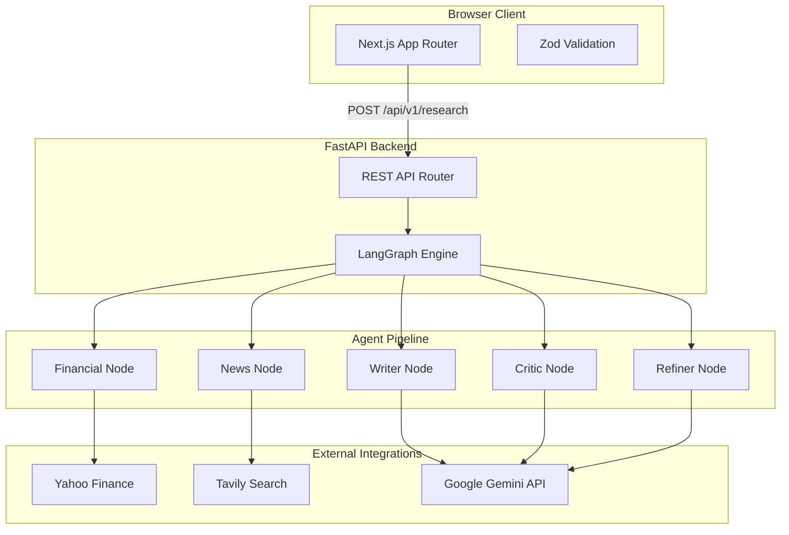

# Verdict

Verdict is an autonomous financial research workspace that synthesizes real-time market data, news sentiment, and algorithmic validation into equity analysis reports. 

[](https://github.com/saiiexd/Verdict-Agentic-Research-Analyst)
[](LICENSE)
[](#)
[](#)
[](#)
[](#)
[](#)

[API Documentation](#rest-api-documentation) | [Installation](#installation) | [Contributing](#contributing)

## Overview

In financial analysis, relying on a single large language model prompt often results in outdated information, factual hallucinations, and mathematical inaccuracies. 

Verdict addresses this limitation through agentic orchestration. Instead of treating the large language model as a static knowledge base, Verdict uses a multi-agent system to actively fetch live data, draft analysis, critique the findings for bias, and iteratively refine the final report. This pipeline ensures that the generated insights are grounded in real-time quantitative metrics and verifiable news citations.

<!-- [Add Screenshot of Research Workspace Here] -->
<!-- [Add Screenshot of Analytics Dashboard Here] -->

## Architecture

Verdict relies on a decoupled architecture. The Next.js frontend operates independently from the FastAPI execution engine, communicating over structured REST payloads. The backend utilizes LangGraph to manage a deterministic state machine, ensuring parallel data extraction before sequential reasoning.



The pipeline execution flow:
1. **Extraction**: The Financial Node and News Node run concurrently to ingest quantitative metrics and qualitative headlines.
2. **Drafting**: The Writer Node synthesizes the raw data into an initial investment thesis.
3. **Validation**: The Critic Node audits the draft specifically for hallucinations, bias, and logic gaps.
4. **Refinement**: If the Critic Node identifies issues, the Refiner Node corrects the draft. The final validated payload is returned to the client.

## Technology Stack

| Component | Technology | Purpose |
|-----------|------------|---------|
| Frontend | Next.js 15, React 19, TailwindCSS | Server-rendered user interface. |
| Backend | Python 3.11, FastAPI, Uvicorn | Asynchronous REST API. |
| Orchestration | LangGraph, Langchain | Stateful multi-agent execution and routing. |
| Intelligence | Google Gemini | Long-context reasoning for synthesis and critique. |
| Data Integration | yfinance, Tavily Search | Live quantitative and qualitative market data ingestion. |
| Validation | Pydantic, Zod | Cross-boundary type safety and schema enforcement. |

## Folder Structure

```text
Verdict-Agentic-Research-Analyst/
├── backend/
│   ├── app/
│   │   ├── agents/            # Individual LangGraph nodes
│   │   ├── api/               # FastAPI route definitions
│   │   ├── core/              # Configuration and exception handling
│   │   ├── schemas/           # Pydantic models for request/response validation
│   │   ├── tools/             # External integrations (Yahoo Finance, Tavily)
│   │   └── workflow/          # LangGraph state machine configuration
│   ├── Dockerfile             # Production container definition
│   └── requirements.txt       # Python dependencies
└── frontend/
    ├── src/
    │   ├── app/               # Next.js App Router pages
    │   ├── components/        # Reusable React UI components
    │   ├── hooks/             # Custom React lifecycle hooks
    │   ├── lib/               # Shared types, Zod schemas, and formatters
    │   └── services/          # Axios HTTP client wrappers
    ├── tailwind.config.ts     # UI styling tokens
    └── next.config.ts         # Build configuration
```

## Installation

### Prerequisites
- Node.js 20 or higher
- Python 3.11 or higher
- Gemini API Key
- Tavily API Key

### Backend Setup

Navigate to the backend directory, initialize a virtual environment, and install dependencies.

```bash
cd backend
python -m venv venv
source venv/bin/activate
pip install -r requirements.txt
```

Start the FastAPI server:

```bash
uvicorn app.main:app --reload --port 8000
```

### Frontend Setup

Navigate to the frontend directory and install dependencies.

```bash
cd frontend
npm install
```

Start the Next.js development server:

```bash
npm run dev
```

Visit `http://localhost:3000` in your browser.

## Environment Variables

Create a `.env` file in both the root directory and the `backend` directory. Do not commit these files to version control.

| Variable | Location | Required | Description |
|----------|----------|----------|-------------|
| `GEMINI_API_KEY` | Backend | Yes | Authenticates Google GenAI API calls. |
| `TAVILY_API_KEY` | Backend | Yes | Authenticates the news scraping search tool. |
| `PORT` | Backend | No | Port for the FastAPI server (Default: 8000). |
| `NEXT_PUBLIC_API_URL` | Frontend | Yes | The absolute URL pointing to the FastAPI backend. |

## Usage Guide

Verdict supports a wide array of global equities. To initiate a research pipeline, enter a valid ticker symbol into the application search bar.

- **US Markets**: Enter standard tickers such as `AAPL` (Apple), `MSFT` (Microsoft), or `NVDA` (Nvidia).
- **Indian Markets**: Append `.NS` for the National Stock Exchange or `.BO` for the Bombay Stock Exchange. Examples include `RELIANCE.NS` or `HDFCBANK.NS`. 

The application natively handles regional data disparities. If an Indian asset is queried, the user interface dynamically shifts financial formatting to Lakhs and Crores to match regional standards. If a specific metric is unavailable from the upstream provider, the application gracefully handles the omission by displaying a neutral fallback rather than generating an inaccurate value.

<!-- [Add Screenshot of Generated Report Here] -->

### Interpreting the Report

The generated dashboard is divided into several modules:

- **Executive Summary**: A concise synthesis of the company's current macroeconomic standing.
- **Investment Thesis**: The core argument derived by the Writer Node.
- **Advanced Fundamentals**: Independent metrics including Forward P/E, Operating Margin, Return on Assets, Debt-to-Equity, and Beta.
- **Market Sentiment**: A visualization mapping the extracted news bias as positive, negative, or neutral.
- **Validation Score**: The explicit confidence score generated by the Critic Node.
- **Citation Explorer**: A grid of verifiable source links supporting the claims made in the report.

## REST API Documentation

### POST /api/v1/research

Generates an end-to-end financial research report for a given ticker.

**Request Body**

```json
{
  "ticker": "AAPL"
}
```

**Successful Response (200 OK)**

```json
{
  "ticker": "AAPL",
  "financial_data": {
    "company_name": "Apple Inc.",
    "exchange": "NMS",
    "currency": "USD",
    "current_price": 185.92,
    "market_cap": 2894561280000,
    "forward_pe": 28.4
  },
  "news": [
    {
      "title": "Apple announces new generative AI capabilities",
      "url": "https://finance.yahoo.com/...",
      "sentiment": "Bullish"
    }
  ],
  "final_report": {
    "executive_summary": "...",
    "investment_outlook": "..."
  },
  "critic_report": {
    "overall_score": 90,
    "hallucination_risk": "Low"
  },
  "metadata": {
    "duration": 14.5,
    "status": "success"
  }
}
```

**Error Responses**

- `400 Bad Request`: Validation failure (e.g., empty or malformed ticker).
- `404 Not Found`: Ticker cannot be resolved via the financial data provider.
- `429 Too Many Requests`: Rate limit exceeded on downstream APIs.
- `500 Internal Server Error`: LangGraph execution failure or unexpected backend state.

All outbound LLM calls utilize a customized retry wrapper that gracefully catches resource exhaustion errors, applying exponential backoff to maintain pipeline stability.

## Deployment

Verdict is designed for stateless, containerized deployment.

### Backend

A production-ready `Dockerfile` is included in the backend directory.

```bash
docker build -t verdict-backend ./backend
docker run -p 8000:8000 --env-file ./backend/.env verdict-backend
```

For production deployment, services like Hugging Face Spaces, Render, or Railway are recommended.

### Frontend

The Next.js application is optimized for Vercel. Ensure you configure the `NEXT_PUBLIC_API_URL` environment variable in your production hosting environment to point directly to your deployed backend URL.

## Contributing

1. Fork the repository.
2. Create your feature branch (`git checkout -b feature/NewFeature`).
3. Commit your changes (`git commit -m 'Add some NewFeature'`).
4. Push to the branch (`git push origin feature/NewFeature`).
5. Open a Pull Request.

Please ensure you run `npm run lint` and `npm run build` in the frontend directory before opening a pull request.

## License

Distributed under the MIT License. See `LICENSE` for more information.