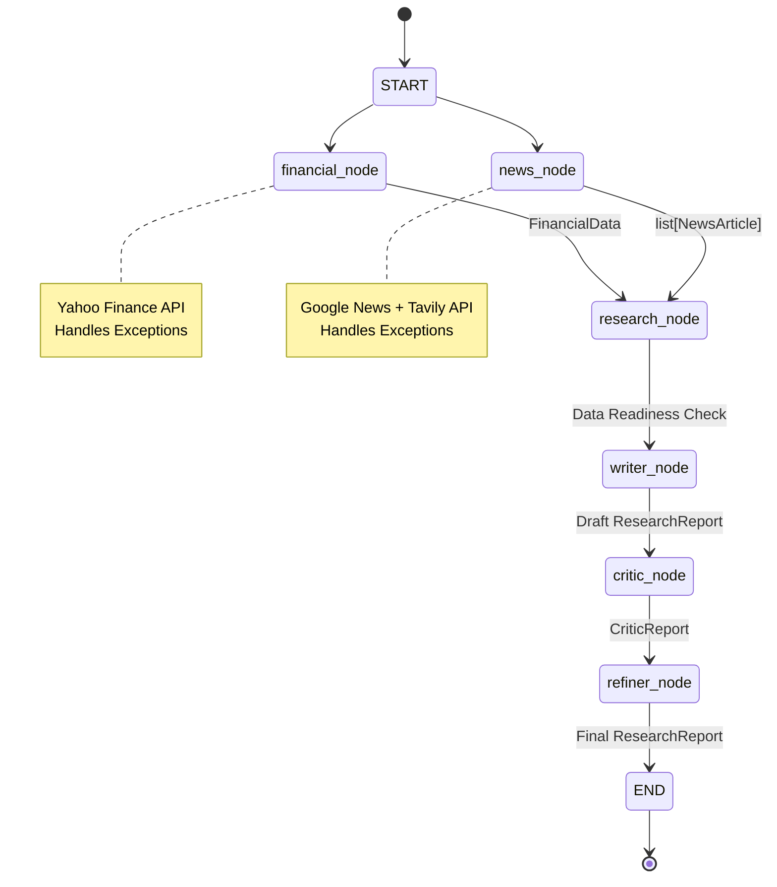

# Verdict Workflow Diagram

### Node Responsibilities
- **financial**: Fetches stock fundamentals using `YahooFinanceTool`.
- **news**: Fetches and deduplicates recent articles using `GoogleNewsTool` and `TavilyTool`.
- **research**: Evaluates if the required data is present to proceed with report generation.
- **writer**: Generates the first draft `ResearchReport` using the `WriterAgent` and structured LLM outputs.
- **critic**: Critiques the draft using `CriticAgent`.
- **refiner**: Merges the draft and critique to produce the final `ResearchReport` using `RefinerAgent`.
