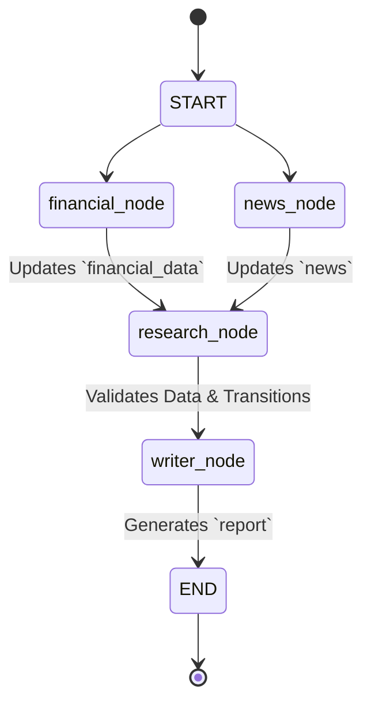

# Workflow Diagram

This document illustrates the LangGraph execution flow for the Verdict research process.

## Research State Graph

## Node Responsibilities

1. **`financial_node`**: Leverages the `FinancialAgent` to synchronously fetch real-time market data utilizing the `YahooFinanceTool`.
2. **`news_node`**: Leverages the `NewsAgent` to concurrently fetch RSS data and semantic web search via `GoogleNewsTool` and `TavilyTool`, returning a deduplicated set of articles.
3. **`research_node`**: Acts as an aggregation and validation barrier. Confirms that `financial_data` and `news` are populated, logging warnings gracefully if they are missing.
4. **`writer_node`**: Injects the consolidated state context into the `WriterAgent`, invoking the abstracted LLM infrastructure to synthesize the equity research report.
