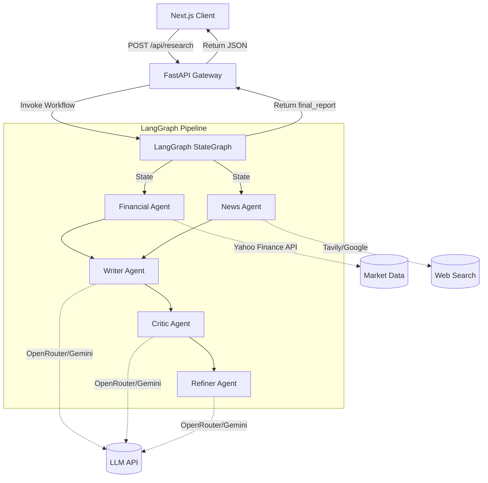

# System Architecture

Verdict is built on a modern, decoupled architecture designed for scalability, reliability, and clear separation of concerns. This document outlines the structural layout of the application, the agentic pipeline, and data flow.

## High-Level Architecture

The platform consists of two main components:
1. **Next.js Frontend (Client)**
2. **FastAPI Backend (Server & Agent Orchestration)**



---

## 1. Frontend Architecture (Next.js)

The frontend is a React application built with the **Next.js App Router**. It is responsible for accepting user input, streaming UI updates, and rendering the highly structured financial reports.

- **Framework**: Next.js 15 (App Router)
- **Styling**: Tailwind CSS
- **State Management**: Zustand (for global application state)
- **Data Fetching**: React Query (for caching and deduplicating API requests)
- **UI Components**: Radix UI (Headless primitives) and custom Bento-box grid layouts.

**Design Philosophy**: The UI is designed to never break, regardless of the LLM output. This is achieved by relying on the backend to guarantee strict JSON schema responses. The Next.js client blindly trusts the structure because it has been validated at the API boundary.

---

## 2. Backend Architecture (FastAPI & LangGraph)

The backend is built with **FastAPI** for high-performance async request handling, and **LangGraph** for managing the complex, multi-agent AI workflows.

### 2.1 The API Layer
The FastAPI gateway receives a `POST /api/research` request containing a stock ticker. 
- **Validation**: Incoming requests are validated using Pydantic (`ResearchRequest`).
- **Routing**: The `research_service.py` intercepts the request and initializes the LangGraph state.
- **Error Boundaries**: A global exception handler catches `InvalidTickerException` and LLM timeout errors, returning formatted 4xx or 500 status codes.

### 2.2 LangGraph State Management
LangGraph acts as a state machine. The state is represented by a `TypedDict` containing all the context needed during the research process:

```python
class ResearchState(TypedDict):
    ticker: str
    financial_data: dict | None
    news: list | None
    report: dict | None
    critic_report: dict | None
    final_report: dict | None
```

### 2.3 The Multi-Agent Pipeline

The core logic resides in `backend/app/graph/nodes.py`. The pipeline operates sequentially:

1. **Financial Node**: Interacts with the `YahooFinanceTool` to scrape real-time pricing, valuation multiples (P/E, EPS), and institutional analyst ratings.
2. **News Node**: Interacts with the `TavilyTool` and `GoogleNewsTool` to search the web for recent catalyst events and sentiment.
3. **Research Node**: A synchronization node that ensures both Financial and News data have successfully populated the state before proceeding.
4. **Writer Node**: Passes the aggregated data to the LLM. The LLM is instructed to generate a first draft of the Bento Box report (Bull/Bear cases, SWOT, etc.).
5. **Critic Node**: Evaluates the writer's output against the raw financial data to catch hallucinations or extreme bias.
6. **Refiner Node**: Takes the original draft and the critic's feedback to output the final, polished, and strictly schema-validated JSON report.

### 2.4 Structured Outputs (Pydantic & Zod)
To ensure the LLM output can be cleanly rendered by React, we use Langchain's `.with_structured_output()` feature bound to a predefined Pydantic schema representing the Bento UI components. This is the single most important architectural decision for production stability, ensuring zero string-parsing errors.

---

## 3. Data Flow Example

1. **User Input**: User enters "AAPL" in the Next.js UI.
2. **API Call**: Next.js sends `{"ticker": "AAPL"}` to FastAPI.
3. **Graph Initialization**: FastAPI creates `ResearchState` with `ticker: "AAPL"`.
4. **Data Gathering**: Financial Agent fetches P/E=30; News Agent fetches "Apple launches Vision Pro 2".
5. **Drafting**: Writer Agent generates draft JSON.
6. **Critique**: Critic Agent flags that the draft forgot to mention Apple's slowing services growth.
7. **Refinement**: Refiner Agent corrects the draft.
8. **Response**: FastAPI returns the fully populated JSON graph state.
9. **Rendering**: Next.js iterates over the JSON and renders the components.
