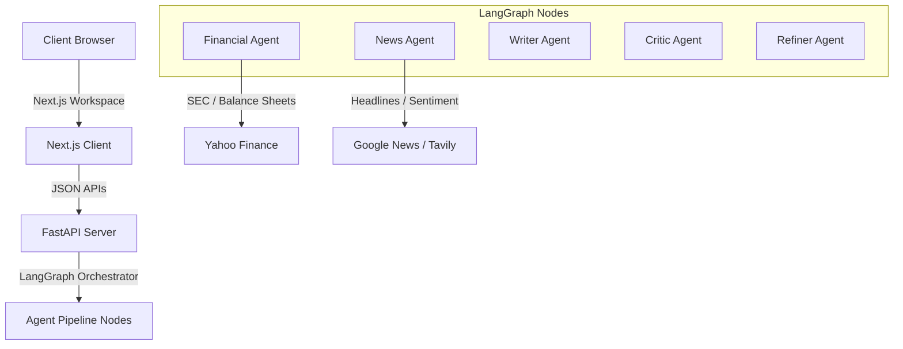

# Final Architecture Specification

This document defines the production-level system design, pipeline mechanics, and backend-frontend interface structures of Verdict.

---

## 1. System Topology

---

## 2. Component Layout & Modular Execution

### Frontend (Next.js App Router)
- **State Store (`Zustand`)**: Manages histories, pinned assets, watchlists, layout preferences, and command states.
- **Visual Analytics (`Recharts`)**: Presentation-only SVG components rendering sentiment indexations and performance metrics.
- **Productivity Toolbar**: Command Palette (`Ctrl+K`), sequence hotkeys (`gd`, `gh`, `gs`), breadcrumb trails, and Focus Mode.

### Backend (FastAPI / LangGraph)
- **FastAPI Endpoint `/research`**: Handles research requests, validates inputs using Pydantic, and executes LangGraph loops.
- **Critic Verification Audits**: Validates reports for bias and logic holes.
