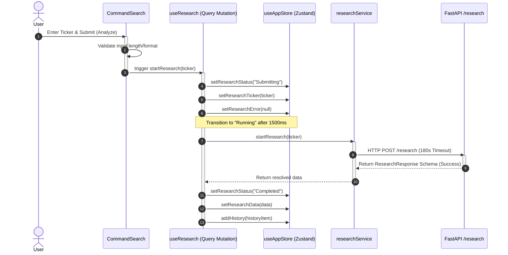

# Frontend API Architecture & Request Lifecycle

This document describes the design patterns, execution lifecycles, error handling rules, and environment configurations governing communication between the Next.js workspace and the FastAPI backend.

---

## 1. Request Lifecycle Overview

The complete user-to-backend request lifecycle is orchestrated across four distinct layers to ensure separation of concerns:

---

## 2. Execution State States

The central Zustand store (`src/store/useAppStore.ts`) tracks the execution state without persisting it:
- **`Idle`**: Initial state prior to any submission. Displays the workspace's default orienting instructions.
- **`Submitting`**: Set immediately when the request is sent, rendering "Analyzing..." in the workspace search.
- **`Running`**: Automatically set 1500ms after submission to simulate handoff to agent pipeline execution.
- **`Completed`**: Triggered when the backend successfully replies with valid JSON schemas, saving data to `currentResearchData`.
- **`Failed`**: Set if any timeout, network error, or backend exception occurs, saving the structured error details to `researchError`.

---

## 3. Error Translation & Recovery Flow

To protect UI components from raw HTTP details, Verdict implements a centralized error mapping system in `src/lib/errors.ts`:

- **`ResearchError` Class**: Standardizes user-facing messages, HTTP statuses, and recovery recommendations.
- **Symbol Validation / 400 / 422**: Translated to `"Invalid symbol requested. Check spelling and retry."` (`isRecoverable: false`).
- **Ticker Not Found / 404**: Translated to `"The requested ticker could not be found on the server."` (`isRecoverable: false`).
- **Rate limiting / 429**: Translated to `"Rate limit exceeded. Please wait a few moments before requesting again."` (`isRecoverable: true`).
- **Internal Server / 500**: Translated to `"Internal agent pipeline error. The AI reasoning engine encountered a failure."` (`isRecoverable: true`).
- **Request timeouts**: Standardized as `"Request timed out. The agent nodes are taking longer than normal."` (`isRecoverable: true`).
- **Disconnection**: Standardized as `"Network connection failure. Check endpoint accessibility and try again."` (`isRecoverable: true`).

### Form State Retention & Recovery Actions
- If execution fails with a recoverable code, the `ReportPanel` mounts a premium **Retry Analysis** button.
- User input is preserved in `CommandSearch` so that users do not have to retype tickers.
- Clicking the retry button resets workflow statuses cleanly and dispatches a new `startResearch` request using the active ticker stored in `currentResearchTicker`.

---

## 4. Report Rendering & Loading Architecture

The `ReportPanel` serves as a structured, accessible layout orchestrator for displaying the final research response. It implements the following key layout components:

- **`RecommendationCard`**: Parses `critic_report` output, mapping scores to recommendation badges (Buy, Hold, Sell) and displaying concise strengths and weaknesses.
- **`MetadataPanel`**: Displays parsed financial key indicators (`Beta`, `Market Cap`, `Current Price`, etc.) in a grid configuration.
- **`ReportSection`**: Renders standard Markdown text fields cleanly with section borders and entrance animations.
- **`CitationList`**: Displays source articles and metadata feeds dynamically on grid cards, allowing external links to open safely.

### Progressive Loading & Skeletons
During active research, the workspace visualizes progress through specialized loading components in `src/components/research/LoadingComponents.tsx`:
- **`ExecutionTimer`**: An elapsed timer ticking in real-time.
- **`ProgressIndicator`**: A horizontal progress bar reflecting pipeline completion.
- **`StatusMessage`**: Contextual text describing what the active agent is doing.
- **`TimelineEvent`**: A vertical execution timeline illustrating milestones (Request Received -> Financial Analysis -> Sentiment Collection -> Synthesis Drafting -> Agent Debate Review -> Refinement Packaging).
- **`LoadingSkeleton`**: Elegant shimmers outlining the document sections in progress.
- **Synchronized Transitions**: As the backend response finishes compiling, Framer Motion staggered transitions smoothly transition these skeletons into completed document sections, providing a premium, cohesive UI handoff.
