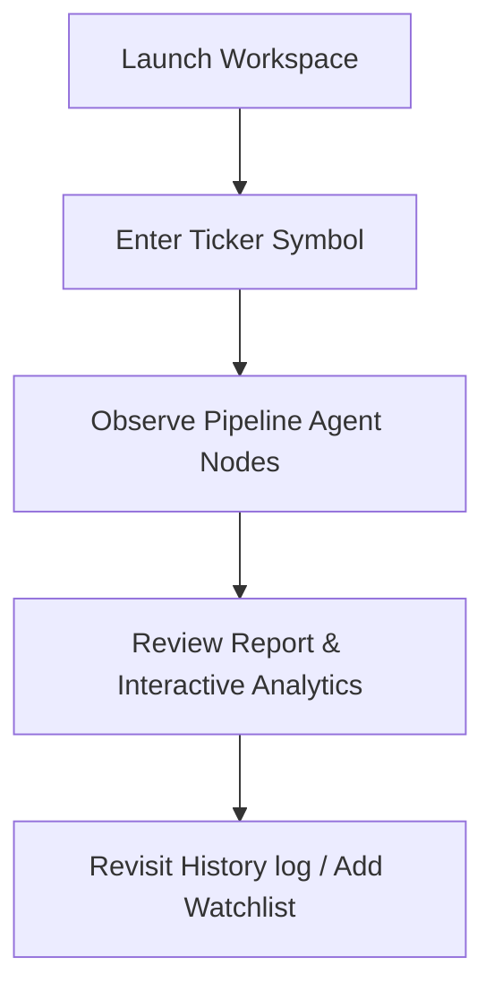

# User Experience (UX) Review

This document audits the user journey, navigation mechanics, and visual friction points across Verdict's layouts.

---

## 1. User Journey Mapping

- **Orientation**: Workspace defaults to showing instructions in Idle state, helping first-time users immediately understand the ticker search requirement.
- **Feedback Loop**: Agent pipelines communicate status progressively (timers, timelines, dynamic status strings), reducing user drop-off.
- **Friction Minimization**: In focus mode, peripheral layout columns collapse automatically, providing an editorial-quality environment for analysis.

---

## 2. Navigation Simplification

- Command shortcut sequences (`gd`, `gh`, `gs`) provide keyboard-native page switches.
- Universal Command Palette (`Ctrl+K`) allows users to search history files, navigate views, or toggle theme systems from a central interface.
- Breadcrumb trails on the Topbar communicate current route segments.
